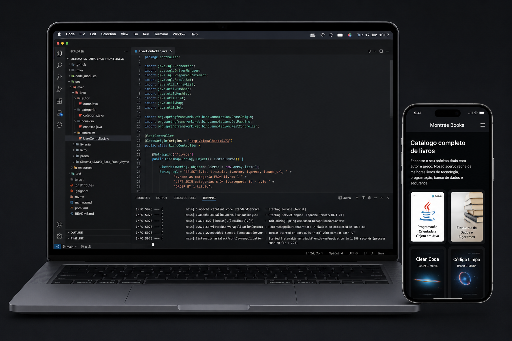

# Sistema de Livraria - Full Stack

## 📚 Sobre o Projeto

Sistema de Livraria é uma aplicação full stack completa para gerenciamento de um acervo de livros. O projeto combina um backend robusto em **Spring Boot** com um frontend moderno em **Vite**, oferecendo uma experiência integrada para consulta e gerenciamento de livros.

## 🎯 Funcionalidades

- ✅ **Listagem de Livros**: Consulte todos os livros disponíveis no acervo
- ✅ **Categorias**: Organize livros por categorias
- ✅ **Informações Detalhadas**: Título, autor, preço e categoria
- ✅ **API REST**: Backend com endpoints bem definidos
- ✅ **Frontend Responsivo**: Interface moderna e intuitiva

## 🛠️ Tecnologias

### Backend
- **Spring Boot** 3.3.0 - Framework web Java
- **Java** 17 - Linguagem de programação
- **Spring Web** - Desenvolvimento de APIs REST
- **Spring JDBC** - Acesso a dados
- **MySQL Connector** - Driver para banco de dados MySQL

### Frontend
- **Vite** - Ferramenta de build rápida
- **JavaScript/TypeScript** - Desenvolvimento frontend

### Banco de Dados
- **MySQL** - Sistema gerenciador de banco de dados relacional

## 📋 Estrutura do Projeto

```
Sistema_Livraria_Back_Front_Jayme/
├── src/
│   ├── main/
│   │   ├── java/
│   │   │   ├── autor/              # Classe para representar autores
│   │   │   ├── categoria/          # Classe para categorias
│   │   │   ├── conexao/            # Configuração de conexão com BD
│   │   │   ├── controller/         # Controllers REST (LivroController)
│   │   │   ├── livraria/           # Classes principais (Main, LivroDAO, ListarLivros)
│   │   │   └── livro/              # Modelo de dados (Livro.java)
│   │   └── resources/
│   │       ├── application.properties
│   │       ├── static/             # Arquivos estáticos frontend
│   │       └── templates/          # Templates HTML
│   └── test/
│       └── java/                   # Testes unitários
├── pom.xml                         # Configuração Maven
├── package.json                    # Dependências Node.js
└── README.md                       # Este arquivo
```

## 🚀 Como Executar

### Pré-requisitos
- Java 17 ou superior
- Maven 3.6+
- MySQL Server
- Node.js (para o frontend)

### Executar o Backend

```bash
# Compilar com Maven
mvn clean build

# Executar a aplicação
mvn spring-boot:run
```

O backend estará disponível em: `http://localhost:8080`

### Endpoints da API

- `GET /livros` - Lista todos os livros disponíveis

### Executar o Frontend

```bash
# Instalar dependências
npm install

# Iniciar servidor de desenvolvimento
npm run dev
```

O frontend estará disponível em: `http://localhost:5173`

## 📊 Modelo de Dados

### Livro
| Campo | Tipo | Descrição |
|-------|------|-----------|
| idLivros | INT | ID único do livro (chave primária) |
| titulo | VARCHAR | Título do livro |
| autor | VARCHAR | Autor do livro |
| preco | DECIMAL | Preço do livro |
| categoria | VARCHAR | Categoria do livro |

## 🔧 Configuração

### application.properties

O arquivo `src/main/resources/application.properties` contém as configurações da aplicação.

### CORS

O backend está configurado para aceitar requisições do frontend em `http://localhost:5173`:

```java
@CrossOrigin(origins = "http://localhost:5173")
```

## 📦 Dependências Maven

- spring-boot-starter-web
- spring-boot-starter-jdbc
- mysql-connector-j
- spring-boot-starter-test

## 🧪 Testes

Execute os testes com:

```bash
mvn test
```

## 📝 Notas de Desenvolvimento

- O projeto utiliza a arquitetura MVC com separação entre controller, modelo (model) e acesso a dados (DAO)
- A conexão com o banco de dados é feita via JDBC
- O frontend se comunica com o backend através de requisições HTTP GET

## 👤 Autor

Desenvolvido para demonstrar conceitos de full stack web development com Spring Boot e Vite.

## 📄 Licença

Este projeto está disponível para fins educacionais e de demonstração.

---
